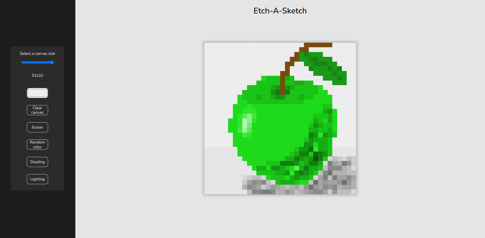

# Etch a Sketch

It is a kids toy that has a screen filled with aluminum powder and a stylus.
There are 2 versions, one with knobs to control the stylus and one with the stylus separated from the screen.
In this case I will recreate the latter and we will use the pointer as the stylus.

In this application you can:
- Create cool pixel art.
- Change the grid size up to 24x24.
- Select the color you want to draw with.
- Use a random color which will give you interesting results.
- Use shades or lights with the colors you use.

## How to use

1. Change the size of the canvas to the desired size with the slider.
2. Pick you favorite color.
3. Drag the mouse over the canvas to draw.
4. Enjoy!
5. You can delete your happy accidents activating the "Eraser" button.
5. Use "Random color" to obtain interesting results.
6. Your color is to dark or to bright? Fix it with the (un)innovating "Shading" and "Lighting" functions.
7. Enjoy!!

### Live site
You can enjoy this software and create fine art at the [live site](https://laughing-pasteur-17ca00.netlify.app/)

### Local host
Why not copy this repository to your machine, mess with the code and see your changes on a local host.

## Known issues
- ~~The pointer is always painting~~.
- If you have any button activated, changing the color you will use will not de-activate the button.

### Firefox
- If you choose a grid with the following sizes (7, 11, 17, and 19) there will be an overflow of the grid (This doesn't break the functionality of the canvas)
- After changing the size of the canvas, the size will go back to the default.

## Contact
Carlos Daniel Regalado Aguirre.

See my other projects on [Github](https://github.com/CarlosDRA)

Mail me at *cd.regaladoaguirre@hotmail.com*